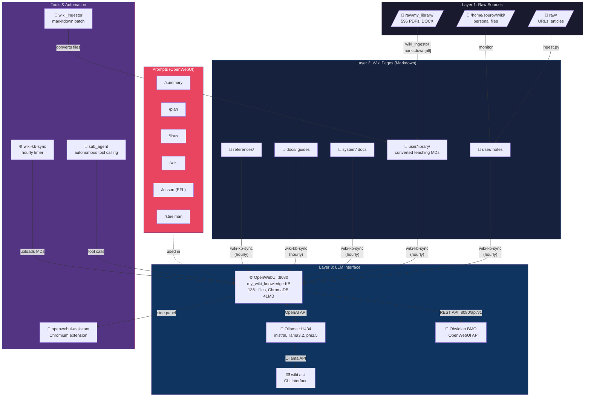

# Wiki-Linux System Architecture

> Karpathy 3-Layer LLM Wiki — Personal Knowledge Operating System

## System Diagram



## Components

### Layer 1 — Raw Sources
| Location | Content | Size |
|----------|---------|------|
| `raw/my_library/` | 596 staged PDFs/DOCX (EFL teaching materials) | ~7.2GB extracted |
| `/home/sourov/wiki/user/my_library/extracted/` | 14 Google Drive exports | 7.2GB |
| `raw/` | Articles, reference docs | varies |

### Layer 2 — Wiki Pages
| Directory | Purpose |
|-----------|---------|
| `user/` | Personal notes, projects, research |
| `user/library/` | Converted teaching materials (markitdown output) |
| `system/` | OS and hardware docs |
| `docs/` | System guides, TinyLLM maintenance |
| `references/` | External references (archwiki, Karpathy) |

### Layer 3 — LLM Interface
| Service | URL | Purpose |
|---------|-----|---------|
| OpenWebUI | `http://127.0.0.1:8080` | Main UI, RAG over `my_wiki_knowledge` |
| Ollama | `http://127.0.0.1:11434` | Local model inference |
| `my_wiki_knowledge` KB | KB ID: `9ead2bd1-bc33-4208-bcff-baffdd890c3b` | 136+ MDs, ChromaDB 41MB |
| Obsidian BMO | via OpenWebUI REST API | In-editor chat |

### Automation Chain
```
[New file appears]
      ↓
wiki_ingestor (watcher/batch)
      ↓ markitdown[all]
user/library/*.md
      ↓
wiki-kb-sync (hourly)
      ↓ OpenWebUI API
my_wiki_knowledge KB
      ↓
All LLMs can query
```

### Services (systemd --user)
| Service | Status | Purpose |
|---------|--------|---------|
| `wiki-monitor` | active | File change monitoring |
| `wiki-sync` | active | Git auto-sync (timer) |
| `wiki-kb-sync` | active | Hourly KB upload |
| `wiki-openwebui` | active | OpenWebUI server |
| `wiki-auto-unzip` | active | Auto-extract downloads |
| `wiki-file-relocate` | active | 30min file organiser |
| `wiki-wallpaper` | active | Wallpaper generation |
| `wiki-boot-popup` | active | Boot status notification |

### OpenWebUI Prompts
| Command | Purpose |
|---------|---------|
| `/summary` | Structured conversation summary |
| `/plan` | Task planning before execution |
| `/linux` | Linux command one-liners |
| `/wiki` | Query my_wiki_knowledge KB |
| `/lesson` | EFL lesson plan generator |
| `/steelman` | Intellectual integrity engine |

### OpenWebUI Tools
| Tool | Purpose |
|------|---------|
| `sub_agent` | Delegate complex tasks to autonomous sub-agent |

## Data Flow

```
Google Drive Exports (7.2GB)
    → /home/sourov/wiki/user/my_library/*.zip (14 zips)
    → bin/wiki-library-extract
    → extracted/ (374 PDFs, 209 DOCX, 178 MP3...)
    → raw/my_library/ (596 staged text files)
    → wiki_ingestor (markitdown[all])
    → user/library/*.md (converted)
    → wiki-kb-sync
    → my_wiki_knowledge KB (OpenWebUI + ChromaDB)
    → All LLM interfaces
```

## Karpathy Alignment

> Based on [Andrej Karpathy's LLM Wiki architecture](bin/history/karpathy-llm-wiki.md)

| Karpathy Concept | This Implementation |
|------------------|---------------------|
| Layer 1: Raw data | `raw/`, extracted Google Drive content |
| Layer 2: Wiki pages | `user/`, `system/`, `docs/` Markdown pages |
| Layer 3: LLM interface | OpenWebUI + my_wiki_knowledge + Ollama |
| Continuous ingestion | wiki_ingestor + wiki-kb-sync |
| Knowledge retrieval | my_wiki_knowledge KB (ChromaDB RAG) |
| Multiple LLM consumers | OpenWebUI UI, Obsidian BMO, CLI, Chromium extension |
